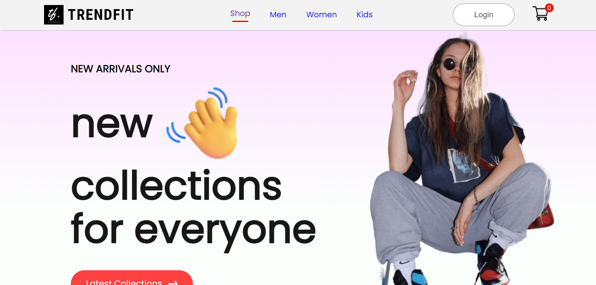

# TrendFit

## Description

This project is a shopping website built using React, React Router, and Auth0 for authentication. Users can browse through various product categories, view product details, add items to the shopping cart, and proceed to checkout. Authentication is handled securely through Auth0, providing users with a personalized experience.



## Getting Started


### Prerequisites

- Node.js installed
- Auth0 account

### Installation

1. **Clone the repository:**

    ```bash
    git clone https://github.com/your-username/your-repo.git
    ```

2. **Install dependencies:**

    ```bash
    npm install
    ```

3. **Configure Auth0:**

   - Create an Auth0 account: [Auth0](https://auth0.com/).
   - Configure your Auth0 application and obtain the domain and client ID.
   - Update the Auth0Provider component in `index.js` with your Auth0 credentials:

     ```jsx
     <Auth0Provider
       domain="your-auth0-domain"
       clientId="your-auth0-client-id"
       authorizationParams={{
         redirect_uri: window.location.origin,
       }}
     >
     ```

4. **Start the development server:**

    ```bash
    npm start
    ```

5. **Open your browser:**

   Navigate to [http://localhost:3000](http://localhost:3000).

## Authentication Setup

1. **Create an Auth0 account:**

   Visit [Auth0](https://auth0.com/) and create an account.

2. **Configure your Auth0 application:**

   Obtain the domain and client ID after configuring your Auth0 application.

3. **Add your credentials:**

   Update the Auth0Provider component in `index.js` with the obtained credentials.

## Usage

- Navigate through different product categories using the navigation bar.
- Click on a product to view its details.
- Add products to the cart and proceed to checkout.
- Log in or sign up using Auth0 for a personalized experience.

## Contributing

If you'd like to contribute to the project, follow these steps:

1. Fork the repository.
2. Create a new branch for your feature or bug fix.
3. Make your changes and submit a pull request.


